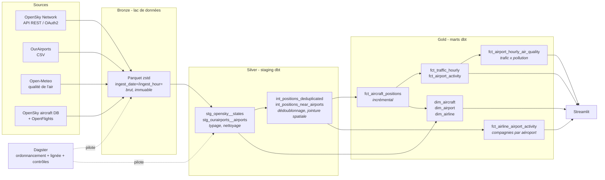

# SkyTrace

**Pipeline de données end-to-end sur le trafic aérien européen.**
Collecte les positions ADS-B de tous les avions en vol toutes les 15 minutes,
les transforme en modèle dimensionnel testé, et les expose dans un tableau
de bord.

> Ingestion Python -> lac Parquet partitionné -> DuckDB -> dbt (staging /
> intermediate / marts) -> Dagster -> Streamlit. Tourne en local sans compte
> cloud, **et se déploie gratuitement en ligne** (GitHub Actions + Streamlit
> Community Cloud) - voir [Déploiement](#déploiement-en-ligne-gratuit).

<!--
Une fois le dépôt public créé, coller les badges ci-dessous (remplacer
<compte> par ton identifiant GitHub) et le lien de la démo Streamlit :

[](https://github.com/<compte>/skytrace/actions/workflows/ci.yml)
[](https://github.com/<compte>/skytrace/actions/workflows/collect.yml)

**Démo en ligne** : https://<compte>-skytrace.streamlit.app
-->

## Pourquoi ce projet

La plupart des projets de portfolio « data » sont des notebooks sur un CSV
figé. Ils ne montrent aucune des compétences qu'on exerce réellement en
Data Engineering : **la donnée qui arrive en continu, qui est sale, qui
grossit, et qu'il faut fiabiliser**.

Les positions ADS-B ont exactement ces propriétés :

| Propriété | Conséquence technique démontrée |
|---|---|
| Flux éphémère (une position non collectée est perdue) | Ordonnancement, idempotence, rejeu |
| ~900 aéronefs × 96 relevés/jour | Partitionnement, format colonnaire, modèle incrémental |
| Champs nuls, indicatifs mal formés, positions aberrantes | Tests de qualité, couche de nettoyage isolée |
| API à quota strict | Gestion de budget, backoff exponentiel, tolérance aux pannes |
| Aucun référentiel intégré | Jointure spatiale avec une source externe |

## Architecture



**Séparation des responsabilités** - chaque couche a un contrat clair :

- **Bronze** : fidèle à la source, aucune interprétation. Permet de rejouer
  n'importe quelle transformation sans re-consommer de quota API.
- **Silver** : typage, nettoyage, dédoublonnage. Correspondance 1<->1 avec la
  source, donc toute anomalie est localisable.
- **Gold** : modèle en étoile, vocabulaire métier. C'est la seule couche que
  le tableau de bord a le droit de lire.

## Démarrage rapide

> Guide complet (installer, lancer, voir les données sous toutes leurs
> formes) : [`docs/guide-lancement.md`](docs/guide-lancement.md).

### 1. Installation

```bash
python -m venv .venv
```

```bash
.venv\Scripts\activate
```

```bash
pip install -e ".[transform,orchestration,dashboard,dev]"
```

### 2. Configuration (optionnelle)

```bash
copy .env.example .env
```

**Le pipeline fonctionne sans aucune configuration**, en mode anonyme
(400 crédits/jour, zone France). Pour aller plus loin, créer un compte sur
[opensky-network.org](https://opensky-network.org), générer un client API
depuis la page *Account*, et renseigner `OPENSKY_CLIENT_ID` /
`OPENSKY_CLIENT_SECRET` dans `.env`.

> Depuis mars 2025, OpenSky n'accepte plus que le flow OAuth2
> `client_credentials` - l'authentification par login/mot de passe est
> supprimée. Le client gère le jeton et son renouvellement automatiquement.

### 3. Premier run complet

```bash
skytrace pipeline
```

Cette commande enchaîne : un snapshot de trafic -> le référentiel aéroports
(au premier lancement) -> `dbt build` (modèles + tests).

### 4. Voir le résultat

```bash
skytrace info
```

```bash
skytrace dashboard
```

Le tableau de bord se recharge périodiquement (réglable dans la barre
latérale) et affiche un **bandeau de fraîcheur** : vert si le dernier relevé
date de moins d'un cycle, rouge s'il remonte à plusieurs heures - auquel cas
le planning Dagster est à l'arrêt et la série temporelle ne se remplit plus.

### 5. Lancer l'orchestrateur

```bash
skytrace dagster
```

L'interface s'ouvre sur `http://localhost:3000` : graphe de lignée complet
(du fichier Parquet jusqu'aux marts), historique des exécutions, contrôles
qualité, et les deux plannings prêts à être activés.

> **Passer par `skytrace dagster` plutôt que `dagster dev` directement.**
> Sans `DAGSTER_HOME`, Dagster crée un répertoire temporaire qu'il supprime
> en sortant : l'historique des matérialisations, l'état actif/inactif des
> plannings et les journaux de run sont perdus à chaque redémarrage - tous
> les assets réaffichent alors *Never materialized*. La commande positionne
> la variable vers `.dagster_home/` (et `PYTHONLEGACYWINDOWSSTDIO`, sans
> laquelle Dagster n'archive pas la sortie des étapes sous Windows).

Au premier lancement, les deux plannings sont **inactifs** : les activer
dans l'onglet *Automation* pour que la collecte tourne toute seule.

## Modèle de données

Modèle en étoile classique, avec deux tables de faits à des grains
différents et deux dimensions conformes.

| Table | Grain | Type |
|---|---|---|
| `fct_aircraft_positions` | 1 aéronef × 1 instant | Fait - **incrémental** |
| `fct_traffic_hourly` | 1 heure × 1 pays | Fait agrégé |
| `fct_airport_activity` | 1 aéroport × 1 heure | Fait agrégé |
| `dim_aircraft` | 1 appareil (adresse OACI 24 bits) | Dimension |
| `dim_airport` | 1 aérodrome | Dimension conforme |

**Points d'ingénierie notables :**

- `fct_aircraft_positions` est **incrémental** avec la stratégie
  `delete+insert` : chaque exécution ne traite que les snapshots nouveaux,
  et rejouer un snapshot remplace ses lignes au lieu de les dupliquer.
- La jointure avion <-> aéroport utilise un **blocking spatial** : une grille
  de 1° réduit le produit cartésien avant le calcul de haversine, qui ne
  s'applique qu'aux couples survivants et à leurs 8 cellules voisines.
- `distinct_aircraft` est documenté comme **mesure non additive** - sommer
  24 heures ne donne pas le total journalier.

## Question analytique : le trafic se lit-il dans le NO2 ?

Une deuxième source, **Open-Meteo Air Quality** (gratuite, sans clé), fournit
les concentrations horaires de polluants au sol aux coordonnées des grands
aéroports. Jointe au trafic dans le mart `fct_airport_hourly_air_quality`,
elle sert une vraie question chiffrée : *plus il y a d'avions autour d'un
aéroport à une heure donnée, plus le NO2 mesuré au sol est-il élevé ?*

La réponse, en contrôlant progressivement les facteurs de confusion :

| Niveau de contrôle | Corrélation avions ~ NO2 |
|---|---|
| Brute (toutes observations) | **+0.15** |
| Intra-aéroport (retrait de l'effet aéroport) | **-0.23** |
| Intra-aéroport et dé-saisonnalisée (retrait du cycle jour/nuit) | **-0.16** |

La corrélation positive naïve **s'inverse** une fois retiré l'effet « entre
aéroports » (les gros hubs sont dans des métropoles au NO2 de fond plus
élevé). **Conclusion : à l'échelle horaire, le trafic aérien n'est pas un
prédicteur détectable du NO2 au sol** - dominé par le trafic routier, le
chauffage et la météo. Le résultat est présenté comme une corrélation
descriptive, et l'hypothèse naïve est explicitement rejetée par les données.

Analyse reproductible (`python scripts/analyse_qualite_air.py`), rapport
détaillé et figure : [`docs/analyse_trafic_qualite_air.md`](docs/analyse_trafic_qualite_air.md).

## Enrichissement flotte : compagnies et constructeurs

Une troisième source croise deux référentiels gratuits pour donner du sens
aux appareils observés :

- **Base aéronefs OpenSky** (~500 000 appareils) : type réel, constructeur,
  modèle et opérateur par adresse OACI 24 bits.
- **OpenFlights** : le préfixe de l'indicatif (AFR, BAW, DLH…) identifie la
  compagnie.

`dim_aircraft` n'est plus seulement dérivée de l'observation : elle porte le
constructeur et la compagnie. Cela débloque des analyses lisibles :

- **Part de marché des compagnies par aéroport** (`fct_airline_airport_activity`) :
  à Paris-CDG, Air France domine devant TNT, FedEx et Delta.
- **Airbus vs Boeing** sur l'ensemble des appareils vus : répartition à peu
  près équilibrée (~34 % / ~35 %), le reste en Embraer, Bombardier, ATR.

Le tableau de bord expose les deux (sélecteur d'aéroport + camembert
constructeurs).

## Qualité des données

Le pipeline embarque **54 tests de données** exécutés à chaque `dbt build`
(9 modèles + 54 tests = 63 nœuds), qui bloquent la construction des modèles
en aval dès qu'un contrôle échoue.

| Type | Exemples |
|---|---|
| Intégrité | unicité de `dim_aircraft`, clés étrangères vers les dimensions |
| Plausibilité physique | latitude ∈ [-90, 90], altitude ∈ [-500 m, 20 000 m], vitesse ≤ 780 kt |
| Domaine | `flight_phase` ∈ {sol, montée, descente, croisière, inconnu} |
| Grain | aucun doublon (appareil, instant) dans la table de faits |
| Cohérence | `distinct_aircraft` ≤ `position_count` dans les agrégats |
| Fraîcheur | `dbt source freshness` alerte si l'ingestion s'est arrêtée |
| Amont | contrôle Dagster : un snapshot vide fait échouer l'exécution |

Le test générique `accepted_range` est implémenté dans le projet plutôt
qu'importé de `dbt_utils` : une dépendance de moins, et le comportement
reste lisible dans le dépôt.

**Pourquoi un snapshot vide est traité comme une erreur** : l'API répond
`200 OK` avec une liste vide. Sans contrôle explicite, le pipeline
continuerait à tourner en produisant du vide, et le problème ne serait
détecté que par un humain regardant un tableau de bord plat.

## Orchestration

Deux cadences, parce que les deux sources n'ont pas la même nature :

| Planning | Fréquence | Contenu |
|---|---|---|
| `traffic_every_15_minutes` | `*/15 * * * *` | Snapshot de trafic + toute la chaîne dbt |
| `reference_daily` | `0 4 * * *` | Référentiel aéroports + reconstruction en aval |

**Le budget de crédits est calculé, pas espéré.** La zone `france` fait
160 deg², soit 3 crédits par appel selon le barème OpenSky. À 96 exécutions
par jour, cela fait 288 crédits sur les 400 alloués en anonyme - la marge
absorbe les relances manuelles. Ce calcul est **verrouillé par un test
unitaire** (`test_france_stays_within_the_anonymous_budget`) : élargir la
zone sans fournir d'identifiants fait échouer la CI.

Un compteur de crédits persisté sur disque refuse tout appel qui dépasserait
le quota, y compris après un redémarrage du worker.

## Décisions techniques

Les arbitrages sont documentés sous forme d'ADR (Architecture Decision
Records) dans [`docs/adr/`](docs/adr/) :

| ADR | Décision |
|---|---|
| [0001](docs/adr/0001-orchestrateur.md) | Dagster plutôt qu'Airflow |
| [0002](docs/adr/0002-entrepot.md) | DuckDB plutôt qu'un entrepôt cloud |
| [0003](docs/adr/0003-modele-dimensionnel.md) | Modèle en étoile, grain et additivité |
| [0004](docs/adr/0004-jointure-spatiale.md) | Blocking par grille plutôt qu'extension spatiale |

Voir aussi [`docs/architecture.md`](docs/architecture.md) pour le détail des
flux, du partitionnement et de la stratégie incrémentale.

## Déploiement en ligne (gratuit)

Le projet tourne en local, mais un pipeline ne se juge qu'en fonctionnement.
Il se déploie donc gratuitement, **sans serveur à administrer** :

- **GitHub Actions** joue le rôle de l'ordonnanceur en production : le
  workflow [`collect.yml`](.github/workflows/collect.yml) collecte un
  snapshot toutes les 30 min, le transforme, et publie les fichiers Parquet
  dans le dépôt. Gratuit et illimité sur un dépôt public, aucun secret requis
  (mode anonyme OpenSky).
- **Streamlit Community Cloud** héberge le tableau de bord. Au démarrage, il
  reconstruit les marts à partir du lac Parquet versionné, puis se redéploie
  à chaque nouvelle collecte.

Dagster n'est pas déployé : il reste l'ordonnanceur de développement local.
GitHub Actions est son équivalent cloud gratuit. Distinguer l'outil de
développement du mécanisme de déploiement fait partie du métier.

**Marche à suivre complète : [`docs/deploiement.md`](docs/deploiement.md).**

## Structure du dépôt

```
src/skytrace/         Bibliothèque : config, client API, ingestion, entrepôt
    config.py           Configuration 12-factor, barème de crédits
    opensky/            OAuth2, client résilient, schéma Arrow
    ingestion/          Écriture Parquet partitionné (couche bronze)
    warehouse/          Accès DuckDB
dbt/skytrace/         Transformations SQL, tests, macros
    models/staging/       Nettoyage et typage
    models/intermediate/  Dédoublonnage, jointure spatiale
    models/marts/         Modèle en étoile
    tests/                Tests singuliers + test générique maison
orchestration/        Assets, contrôles, jobs et plannings Dagster
dashboard/            Application Streamlit (auto-reconstruction cloud)
scripts/              Génération de données synthétiques (démo, CI)
tests/                Tests unitaires Python (réseau simulé)
docs/                 Architecture, ADR et guide de déploiement
requirements.txt      Dépendances lues par Streamlit Community Cloud
.github/workflows/    ci.yml (tests) + collect.yml (collecte planifiée)
```

## Limites connues

Elles sont assumées et documentées plutôt que masquées :

- **La zone est un rectangle**, pas une frontière. La fenêtre « France »
  attrape Zurich, Barcelone et Gatwick. C'est le comportement de l'API
  OpenSky, qui ne prend qu'une boîte englobante.
- **Atterrissage / décollage sont inférés**, pas déclarés. ADS-B ne diffuse
  pas de plan de vol : les colonnes `climbing_aircraft` et
  `descending_aircraft` reposent sur le taux de montée observé à proximité
  d'un aéroport. Fiable en tendance, pas comme comptage officiel de
  mouvements.
- **La couverture ADS-B est très inégale — c'est la limite principale.** Le
  réseau OpenSky repose sur des récepteurs hébergés par des bénévoles : là où
  personne n'en installe, aucun avion n'est vu, même s'il en passe. Mesuré sur
  un relevé mondial de 8 194 aéronefs :

  | Europe | Amérique du Nord | Asie (S/E) | Afrique | Moyen-Orient | Russie |
  |---|---|---|---|---|---|
  | 57 % | 19 % | 13 % | 4 % | **0,6 %** | **0,2 %** |

  Le Moyen-Orient à 0,6 % alors que Dubaï et Doha comptent parmi les premiers
  hubs mondiaux montre bien qu'il s'agit d'un biais d'observation, pas d'une
  réalité du trafic. **Ces données mesurent le trafic observable par le
  réseau, pas le trafic réel** : toute comparaison entre régions est donc à
  proscrire, et les analyses de ce projet restent intra-région ou
  intra-aéroport.
- **En mode anonyme, pas d'historique.** Seul l'instant présent est
  accessible : la profondeur d'historique se construit en laissant tourner
  l'ordonnanceur.

## Sources et licences

- [OpenSky Network](https://opensky-network.org) - données ADS-B, usage
  non commercial et recherche
  ([conditions](https://opensky-network.org/about/terms-of-use))
- [OurAirports](https://ourairports.com/data/) - référentiel aéroports,
  domaine public
- [Open-Meteo](https://open-meteo.com/) - qualité de l'air, usage non
  commercial gratuit
- [OpenSky aircraft database](https://opensky-network.org/aircraft-database) -
  métadonnées aéronefs, usage non commercial et recherche
- [OpenFlights](https://openflights.org/data.html) - référentiel compagnies,
  Open Database License

Code sous licence MIT.
