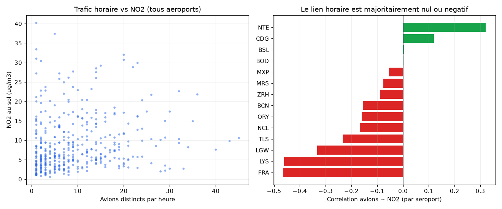

# Le trafic aerien se lit-il dans le NO2 au sol ?

Analyse construite sur le mart `fct_airport_hourly_air_quality`, qui joint l'activite aeroportuaire horaire (positions ADS-B OpenSky) aux concentrations de polluants mesurees au sol a proximite (Open-Meteo).

## Donnees

- Panel : **409 observations** (aeroport x heure).
- Aeroports : **14**.
- Periode : 2026-08-17 19:00:00+00:00 -> 2026-08-22 20:00:00+00:00 (UTC).

> Echantillon encore modeste : il s'etoffe a chaque execution du pipeline. Les ordres de grandeur ci-dessous sont deja stables, la precision augmentera avec le temps.

## Resultat

Hypothese testee : *plus il y a d'avions autour d'un aeroport a une heure donnee, plus le NO2 mesure au sol est eleve.*

| Niveau de controle | Correlation avions ~ NO2 |
|---|---|
| 1. Brute (pooled) | **+0.159** |
| 2. Intra-aeroport (retrait de l'effet aeroport) | **-0.201** |
| 3. Intra-aeroport et de-saisonnalisee (retrait du cycle jour/nuit) | **-0.072** |

> Le chiffre est un **coefficient de correlation de Pearson (r)** : sans unite, de -1 (tendances opposees) a +1 (tendances identiques), 0 signifiant aucun lien. Le NO2 sous-jacent est mesure en microgrammes par metre cube (ug/m3).

Vu aeroport par aeroport, la correlation est negative pour **10 des 14** aeroports ayant assez d'heures :

| Aeroport | Heures | r (avions ~ NO2) |
|---|---|---|
| FRA | 33 | -0.465 |
| LYS | 25 | -0.461 |
| LGW | 35 | -0.333 |
| TLS | 25 | -0.235 |
| NCE | 27 | -0.167 |
| ORY | 33 | -0.161 |
| BCN | 35 | -0.156 |
| ZRH | 35 | -0.087 |
| MRS | 23 | -0.076 |
| MXP | 34 | -0.054 |
| BOD | 22 | +0.002 |
| BSL | 34 | +0.003 |
| CDG | 34 | +0.120 |
| NTE | 14 | +0.320 |

## Interpretation

La correlation brute, faiblement positive, disparait des qu'on controle les facteurs de confusion :

- **Effet 'entre aeroports'.** Les grands hubs sont dans des metropoles au NO2 de fond plus eleve. Ils cumulent donc beaucoup de trafic ET beaucoup de NO2, ce qui gonfle la correlation globale sans qu'il y ait de lien de cause a effet. Une fois la moyenne de chaque aeroport retiree, cet artefact tombe.
- **Cycle journalier partage.** Trafic aerien et NO2 (chauffage, trafic routier) montent le jour et baissent la nuit. Retirer la moyenne par heure de la journee neutralise ce co-mouvement.

**Conclusion : a l'echelle horaire, le trafic aerien n'est pas un predicteur detectable du NO2 au sol.** Le NO2 mesure a proximite d'un aeroport est domine par le trafic routier, le chauffage et la meteo, pas par les avions eux-memes. Le resultat est presente comme une correlation descriptive, jamais comme une causalite - et l'hypothese naive de depart est explicitement rejetee par les donnees.

## Limites

- Open-Meteo fournit un NO2 **modelise** (reanalyse), pas une station de mesure physique au bout de piste.
- Le point de reference est le centre de l'aeroport ; le panache reel depend du vent, non pris en compte ici.
- L'activite est inferee de la couverture ADS-B, inegale selon les zones.
